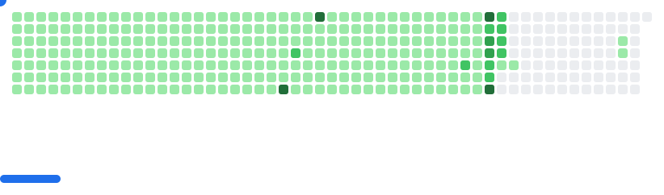

<!-- GitAds-Verify: 8Y1AT9UZE7P9KGOFYPYUEFD3IZNU5CCU -->
## GitAds Sponsored

<!-- Modern Stats Cards -->

    <h1 align="center">
    
  </h1>
  

  
  &nbsp;
    
  &nbsp;
  

<h3 align="center">
    👉 <a href="https://munna-soft.github.io/Portfolio" target="_blank">See Live Portfolio</a> 🚀
</h3>

# ❤️ Support My Open‑Source Work  

If my project help you, please ⭐ star my repos —  
It motivates me to build **more awesome systems**!

<picture>
  <source
    media="(prefers-color-scheme: dark)"
    srcset="assets/breakout-dark.svg"
  />
  <source
    media="(prefers-color-scheme: light)"
    srcset="assets/breakout-light.svg"
  />
  
</picture>

---

<!--Code Developed by Munna MasterMind-->
